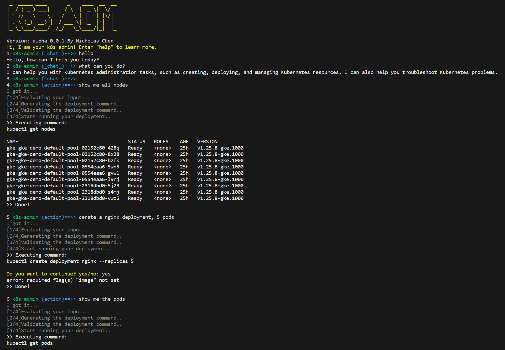

# My K8S Admin

## What is My K8S Admin

My K8S Admin is a Large Language Models (LLMs)-powered Kubernetes admin assistant. It can help improve your productivity when deploying and managing your container workloads on Kubernetes. With the power of LLMs, My K8S Admin can understand your instructions and execute management tasks on your behalf. You can also chat with My K8S Admin to obtain context-related technical information. Currently, My K8S Admin is backed by Google's PaLM 2 LLMs, specifically the chat-bison and code-bison model.


Video Demo: https://youtu.be/HYwiQVPh9eQ

> This is a prototype application for exploring how LLM can improve the productivity of building, delivering, and managing cloud-native applications. It is not intended for production use. Please read the limitation section for more information.

## How to setup

1. Install `Python 3.9` or above, `gcloud` ([howto](https://cloud.google.com/sdk/docs/install)) and `kubectl` ([howto](https://cloud.google.com/kubernetes-engine/docs/how-to/cluster-access-for-kubectl)). 
2. Git clone or download the source code.
3. Install the required Python dependencies with following command:

```bash
pip install -r requirements.txt
```

1. To begin, create a Google Cloud service account and a service account JSON key. Make sure that the service account has the 'Vertex AI User' role. For more information, please refer to the following link: https://cloud.google.com/iam/docs/keys-create-delete#iam-service-account-keys-create-console
2. Save the service account key to `/opt/sa.key`, or edit the `src/config.py` file to specify the path to your key by changing the value of the `gcp_service_account_key` variable.
3. Set up cluster access for `kubectl` as you normally would.

## Try it out

To start My K8S Admin, simply run the following command which will start an interactive shell:

```bash
./k8s-admin
```

You can also run it in non-interactive action mode. Here is an example:

```bash
./k8as-admin -a show me all the nodes
```

## The interactive mode

The interactive mode provides and Unix shell-style interactive user interface. Users can chat with the system, and ask the system to execute tasks. There are two sub-mode in the interactive mode, `Chat` and `Action`. 

- Hit `Enter`to switch between Chat and Action mode.
- `Chat mode` allows users to interact with the system for technical questions. For example, users can request sample Kubernetes object definitions, and ask the system to customize these definitions.
- `Action mode` allows users to instruct the system to perform management tasks, such as displaying all pods in the cluster, creating a new deployment, or scaling a deployment.

Following are some commands which users can use in the interactive shell.

```python
> Type 'history' or 'his' to see model output history.
> Type 'apply @<history number>' to apply a previous definition.
> Type 'apply @' to apply the last definition.
> Add '+' at the end of your command to skip confirmation.
> Type 'help' to see this help text again.
> Type 'exit' to exit
```

## The non-interactive mode

The non-interactive mode, or so called action mode, make it convenient to use the system in your favorite shell and integrate it with scripts and other programs. You can invoke the non-interactive mode by using option `-a` at start.

There is a shortcut wrapper for the non-interactive action mode. You can add the shortcut `k` to your path. After doing so, you can call the system in a minimalist style.

```bash
k show me all the nodes
```

## Options

```bash
Usage: k8s-admin [options] [instruction]
-s, start the interactive shell mode
-a, run non-interactive action mode
-h, help

Examples:
k8s-admin -s
k8s-admin -a list all nodes
k8s-admin -h 
```

## Limitation & Risks

This is a preliminary exploration on using LLM in the domain of cloud nation applications. State-of-the-art LLMs have demonstrated stunning performance, but none of them are perfect. LLMs still experience issues such as hallucinations.

My K8S Admin will request user confirmation before executing certain non-read-only actions to provide protection. However, please note that this protection is not 100% secure. Therefore, do not use this project in production environments and use it wisely and at your own risk. The author(s) of the project will not be responsible for any damage caused by using this project.

## Feedback

Welcome to try out My K8S Admin! Please share your feedback by filing GitHub issues or messaging me. If you find this project interesting, please consider starring it to show your support. I appreciate your help and look forward to your participation.

## Reference

1. [Google Cloud Vertex AI Generative AI](https://cloud.google.com/vertex-ai/docs/generative-ai/learn/overview)
